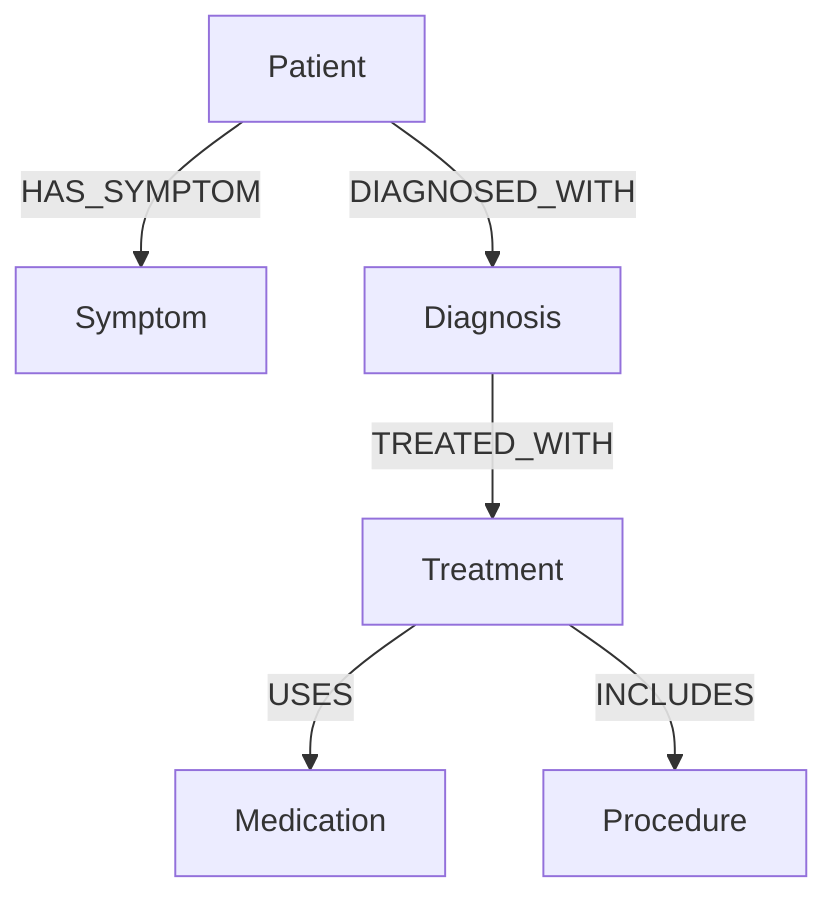
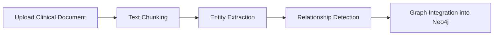
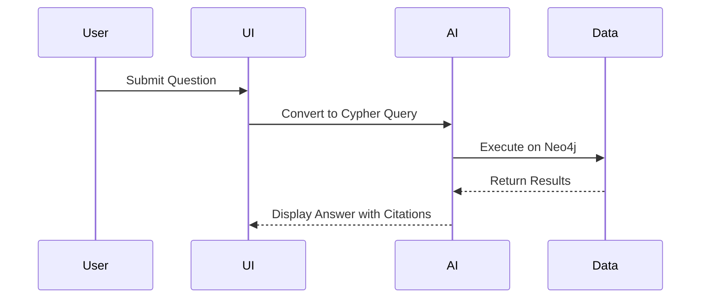

# Breast Cancer Knowledge Explorer


> **Explore Breast Cancer Clinical Knowledge with Natural Language.**  
> Build powerful insights from documents, visualize complex relationships, and answer clinical questions intuitively.

---

## 🌟 Features

- 🧠 **Natural Language QA**: Ask clinical questions in plain English.
- 🕸️ **Knowledge Graph Database**: Powered by Neo4j for breast cancer information.
- 📄 **Document Processing**: Extracts entities & relationships from text.
- 📈 **Interactive Visualizations**: Analyze graph structure and query results.
- 🔗 **Citation Tracking**: Link answers back to original documents.

---

## 🏗️ System Architecture

```mermaid
flowchart TD
    UI[UI Layer (Streamlit)]
    AI[AI Layer (Google Gemini Models)]
    Process[Processing Layer (LangChain)]
    Data[Data Layer (Neo4j Graph Database)]

    UI --> AI
    AI --> Process
    Process --> Data
    Data --> UI
```

> **Simple flow**: UI ↔ AI ↔ Processing ↔ Database

---

## 🚀 Quick Start

### 1. Prerequisites
- Python 3.8+
- Neo4j database instance
- Google API Key with Gemini access

### 2. Setup Instructions

```bash
# Clone repository
git clone https://github.com/yourusername/breast-cancer-knowledge-explorer.git
cd breast-cancer-knowledge-explorer

# Create virtual environment
python -m venv venv
source venv/bin/activate  # Windows: venv\Scripts\activate

# Install dependencies
pip install -r requirements.txt

# Set environment variables
cp .env.example .env
# Fill in Neo4j credentials and Google API key in .env
```

### 3. Launch Application

```bash
streamlit run app.py
```

---

## 📊 How It Works

### 🧩 Knowledge Graph Model



- **Nodes**: Patient, Symptom, Diagnosis, Treatment, Medication, Procedure
- **Relationships**: Rich links like `HAS_SYMPTOM`, `TREATED_WITH`, `USES`, etc.

---

### 📚 Document Processing Pipeline



- **Extracts**: Entities like symptoms, treatments, and links them.
- **Populates**: The graph database automatically.

---

### ❓ Natural Language Question Flow



> Powered by **Google Gemini** and **LangChain’s GraphCypherQAChain**.

---

## 🔍 Example Queries

- *"What symptoms are associated with inflammatory breast cancer?"*
- *"Which treatments show best outcomes for HER2-positive patients?"*
- *"What are common side effects after mastectomy surgery?"*

---

## 🔄 Supported Data Sources

- Clinical research papers
- Medical guidelines and protocols
- De-identified patient records
- Clinical trial data

> 🌐 Explore more about breast cancer at the [Indian Cancer Society](https://www.indiancancersociety.org/breast-cancer/index.html).

---

## 💻 Important Components

| Component | Description |
|:---|:---|
| `Neo4jGraph` | Interface to communicate with the Neo4j database |
| `LLMGraphTransformer` | Converts clinical text into graph entities |
| `GraphCypherQAChain` | Translates natural language into Cypher queries |
| `GoogleGenerativeAI` | Powers natural language understanding |

### Key Functions:

- `connect_neo4j()`: Connects to Neo4j
- `process_uploaded_file()`: Converts uploaded documents to graph data
- `setup_qa_chain()`: Sets up the question-answering chain
- `display_graph_stats()`: Displays graph metrics and stats

---

## 🤝 Contributing

We welcome contributions!

```bash
# Steps
- Fork the repository
- Create a branch: git checkout -b feature/my-feature
- Commit changes: git commit -m 'Add new feature'
- Push branch: git push origin feature/my-feature
- Create a Pull Request
```

---

## 🙏 Acknowledgements

- [LangChain](https://github.com/langchain-ai/langchain)
- [Neo4j](https://neo4j.com/)
- [Google AI](https://ai.google/)
- [Streamlit](https://streamlit.io/)
- [Indian Cancer Society](https://www.indiancancersociety.org/)

---


